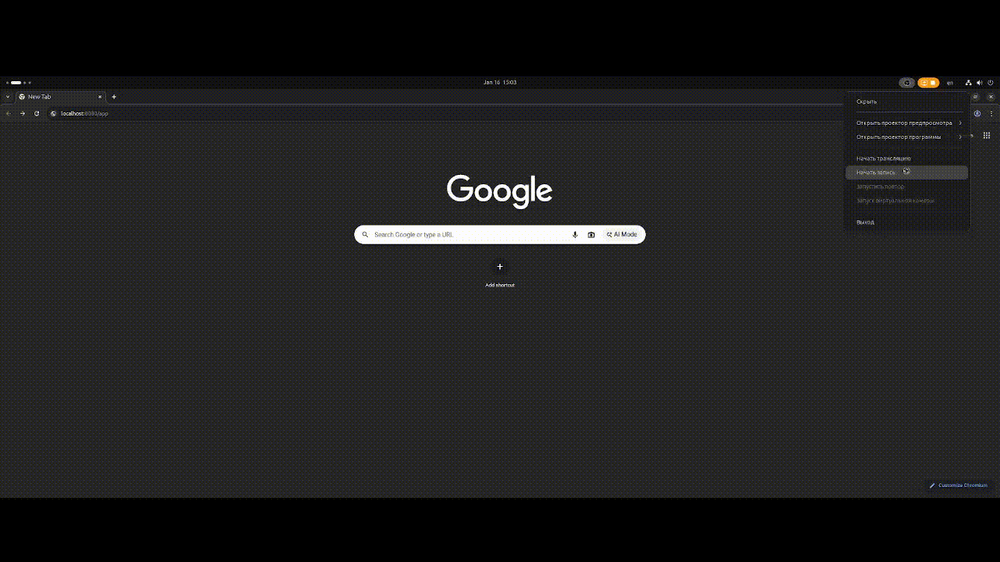

# Stage_1_SpringBlog

## *EN*
#### A simple project to demonstrate basic development capabilities using the Spring framework
#### Technology stack: Spring Framework, H2DB, HTML, Thymeleaf, Junit5, Mockito

### Application features:
    - adding posts
    - editing posts
    - deleting posts
    - searching posts by tags
    - adding comments to posts
    - editing comments to posts
    - deleting comments to posts

### Application deployment:
    - Before you begin, you'll need:
              - Tomcat Server (version 10.1.26 was used during project development): download the archive
                from the official website and unzip it to a convenient location
              - Java (JRE) (version 22 was used during project development)
    1. Using an IDE (IntelliJIdea was used during project development):
            - clone the repository
            - open the project in the IDE
            - create and configure the Tomcat Server configuration -> local
            - run the configured configuration
            - the application's start page will open in the browser
            - stop the application in the IDE when finished
    2. Without using an IDE
            - clone the repository
            - enter the command in the root of the project folder: ./mvnw clean package
            - a file app-1.0-SNAPSHOT.war will appear in the folder /app/target
            - copy this file to the Tomcat Server folder: /tomcat/webapps
            - run the startup.sh script in the /tomcat/bin folder. This will start the server and deploy the application
            - open a browser at http://localhost:8080/app-1.0-SNAPSHOT/posts
            - the application's start page will open
            - when finished, run the shutdown.sh script in the /tomcat/bin folder to stop the application

### Testing the application:
    1. Using an IDE (IntelliJIdea was used during project development):
            - right-click on the test folder and select "Run Tests in 'SimpleSpringBlog'"
            - all tests in the project will run
    2. Without an IDE
            - open a terminal in the project folder and enter the command: ./mvnw test
            - all tests in the project will run

## *RU*
#### Простой проект для демонстрации базовых возможностей разработки с использованием фреймворка Spring
#### Технологический стек: Spring Framework, H2DB, HTML, Thymeleaf, Junit5, Mockito

### Возможности приложения:
    - добавление постов
    - редактирование постов
    - удаление постов
    - поиск постов по тегам
    - добавление комментариев к постам
    - редактирование комментариев к постам
    - удаление комментариев к постам

### Развертывание приложения:
    - Перед началом работы необходимы:
            - Tomcat Server (при разработке проекта использовалась версия 10.1.26): скачать архив
              с официального сайта и распаковать в удобное место
            - Java (JRE) (при разработке проекта использовалась версия 22)
    1. Через IDE (при разработке проекта использовалась IntelliJIdea):
            - клонировать репозиторий
            - открыть проект в IDE
            - создать и настроить конфигурацию Tomcat Server -> local
            - запустить настроенную конфигурацию
            - в браузере откроется стартовая страница приложения
            - по завершению работы остановить приложение в IDE
    2. Без использования IDE
            - клонировать репозиторий
            - в корне папки проекта ввести команду: ./mvnw clean package
            - в папке /app/target появится файл app-1.0-SNAPSHOT.war
            - скопировать данный файл в папку Tomcat Server: /tomcat/webapps
            - в папке /tomcat/bin выполнить скрипт startup.sh - запустится сервер и развернется приложение
            - зайти в браузер по адресу http://localhost:8080/app-1.0-SNAPSHOT/posts
            - откроется стартовая страница приложения
            - по завершению работы в папке /tomcat/bin выполнить скрипт shutdown.sh для остановки приложения

### Тестирование приложения:
    1. Через IDE (при разработке проекта использовалась IntelliJIdea):
            - на папке test нажать ПКМ и выбрать пункт "Run Tests in 'SimpleSpringBlog'"
            - запустятся все тесты проекта
    2. Без использования IDE
            - в папке проекта вызвать терминал и ввести команду: ./mvnw test
            - запустятся все тесты проекта
